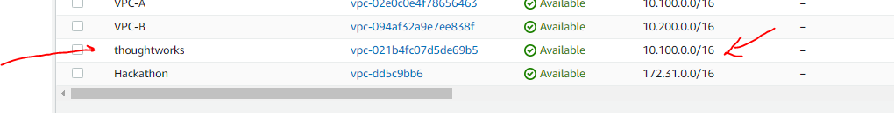
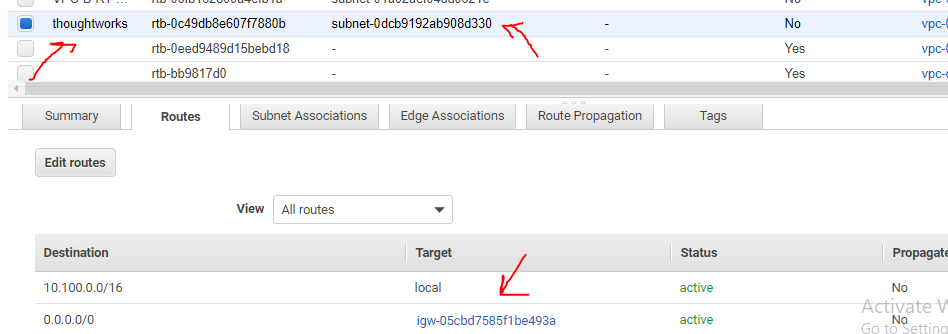
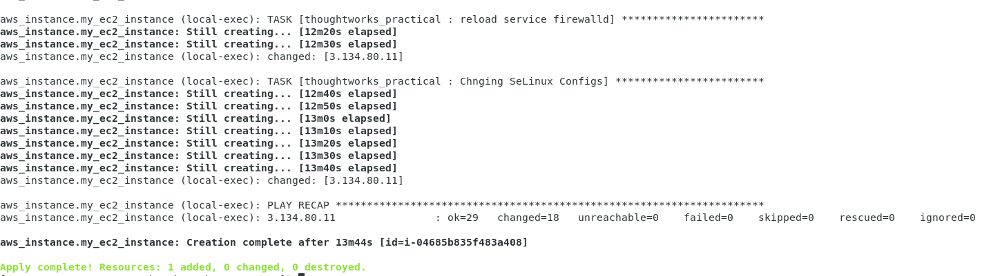
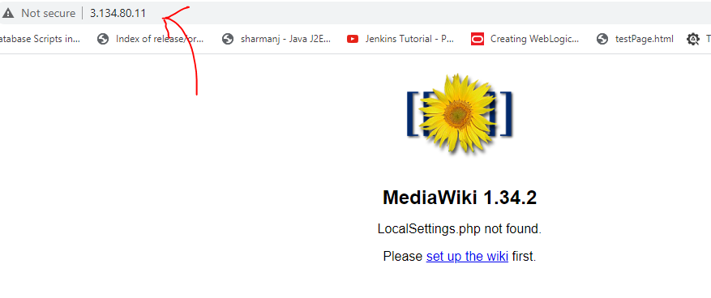

# Problem Statement

### We want you to automate the deployment of MediaWiki using one that you are most comfortable  with:

#### Kubernetes with Helm Chart/ any equivalent automation
#### CFT with Any Configuration Management Tool (Only for AWS). If any 
#### Terraform with any Configuration Management tool integrated.

[Link to documentation How to install it](http://www.mediawiki.org/wiki/Manual:Running_MediaWiki_on_Red_Hat_Linux)

# Solution

I am choosing Method 3 & using Cloud as AWS i.e 

####  Terraform with any Configuration Management tool integrated

## Pre-Requisite 

### a) Must have an account on AWS .Plus Should have valid AWS user (Access Key and Secret ID) with permissions atleast to create Insrance/VPC/Subnet/IGW/Routetable

If you donot Have above follow below Links and steps
* Create Free tier AWS Account
* Get Acess Key and Secret 

### a) Ansible (atleast version 2.9.4) + Hashicorp Terraform Version (atleast version 0.12) to be present on host machine 

If you donot have above follow below links  
* Install Ansible
* Install terraform

------------------------------------------------------------------------------
# How to use this Repo ?

## Clone repo
> git clone https://github.com/anurag4516/thoughtworks_assgnment.git  

> cd thoughtworks_assgnment

## Customize your I/P Parameters 

* Set AWSAccess key in  aws_access_key variable in variables.tf
* Set AWSSecret key in  aws_secret_key variable in variables.tf
* Set AmiID key in  ec2_ami variable in variables.tf
* Set AWS user Pem key naem in  ec2_key_name variable in variables.tf

Once you have above Prerequisite you can Directly use this repo to deploy media wiki in your AWS Env by firing below command .
> terraform apply -auto-approve

# What this Actually Does ?
* Creates a VPC in YOur AWS region 

* Creates Public Subnet in your VPC

* Attach Your IGW to Subnet

* Create Rote Table and associate RT to public subnet add a route to IGW

* Add an EC2 instance 

* Deploy Media Wiki App via ansible in that EC2 Instance you can access that app via http://{PublicIPOfInstance}

